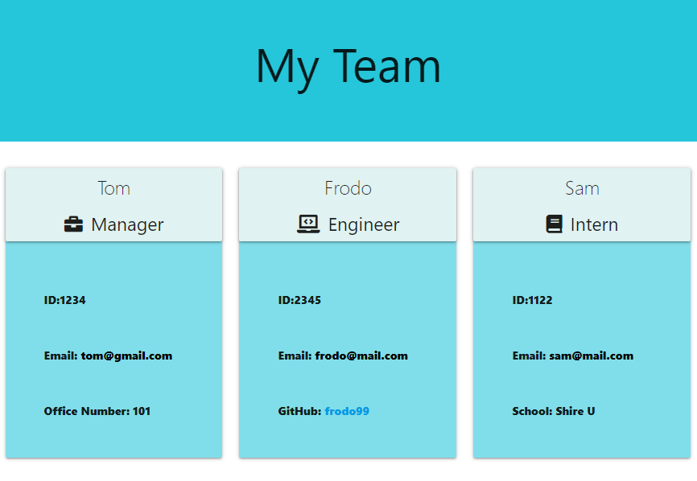

  # Team Builder
  

  ## Description
  Team Builder is a team profile generator that you can quickly create an HTML file with cards for each of your employees which include their emails and GitHub profiles. This app uses Node.js, as well as Inquirer to prompt questions in the command line which. Jest was also used for Test Driven Development.
  After going through the series of questions for your employees, an HTML file will be generated in the dist folder as well as an assets folder containing a CSS file.

  #### Team Builder questions and answers example:
  

  #### HTML Webpage generated from answers:
  

  ## Table of Contents
  * [Installation](#installation)
  * [Usage](#usage)
  * [Contributing](#contributing)
  * [Questions](#questions)
  * [Links](#links)
  * [License](#license)  

  ## Installation
  - Make sure Node.js is installed on your computer. 
  - Clone or download the repository from GitHub. 
  - You may need to install the required modules by running `npm install` in the terminal.
  

  ## Usage
  This app can be used to quickly create a team profile webpage for easy access to your team's important info, email and GitHub profiles. After completing the series of questions, you will have a new HTML file that you can open in your web browser.

  * In the terminal, navigate to Team Builder's directory and run `node index` to invoke the app.
  * You will be prompted with a series of questions about the manager and additional employees.
  * The question types used include text input, yes/no questions and a list. Type in text input answers, use the up/down arrows for the list then enter to select the answer, and y/n then enter for the yes/no questions.
  * Once all the questions have been answered, your answers will print to the terminal and a confirmation will also appear in the terminal that your HTML file has been generated. 
  * A new HTML file named index.html will be created in the /dist directory along with a style.css file in the /assets/style directory. 
  * Open the index.html in your web browser to view the generated webpage.
  * If moving the index.html and the style.css files to another directory, make sure to move both the index.html and /assets directory because the CSS file in there is needed for the index.html file.

  ## Contributing
  If you would like to contribute to this app, please contact me by email listed below.

  ## Questions
  Please visit my **[GitHub profile](https://github.com/tchestnut85/)** to check out this and other projects I've created and contributed to.
  If you have any specific questions about this project, please contact me at <tchestnut85@gmail.com>.

  ## Links
  - **[Click here](https://github.com/tchestnut85/team-builder/)** to visit this project's GitHub repo.
  - View a walkthrough video **[here](https://drive.google.com/file/d/17Rn8EwEGaD9NddtqaF6pLBL1d8c4isjb/view?usp=sharing)**.
  - See a sample HTML file generated from the app **[here](https://github.com/tchestnut85/team-builder/blob/main/assets/demo/index.html)**.

  ## License
  
  
  This app is licensed under the MIT license.
